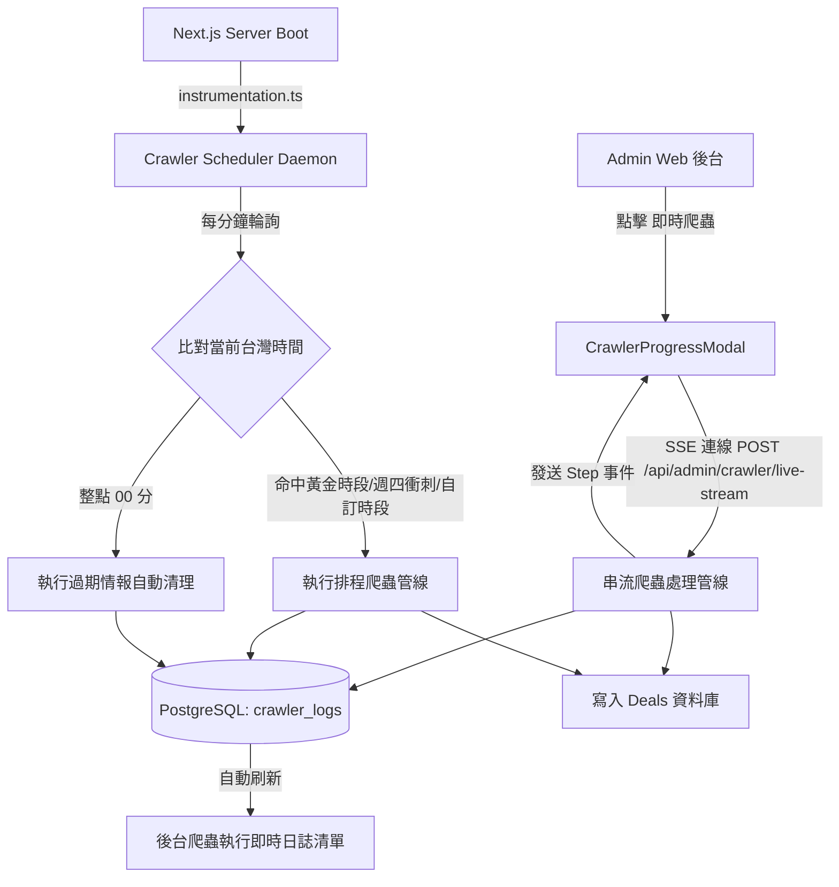

# PRD: 爬蟲伺服器排程常駐運行、真實日誌持久化與即時爬蟲處理狀況中樞

## 1. 背景與問題陳述 (Background & Problem Statement)

在先前版本中，管理後台與爬蟲機制存在三大痛點：
1. **排程無法伺服器自動運行**：過去爬蟲依賴外部獨立執行腳本或 Vercel Cron，缺乏伺服器進程內建的常駐排程機制；當使用者在後台調整黃金時段或站點自訂時段時，排程僅保存在臨時記憶體變數，伺服器重啟或無人操作時不會依照規劃時間自動觸發。
2. **管理後台爬蟲日誌為假資料 (Mock)**：先前 `admin-dal.ts` 寫死三筆靜態 mock 日誌，伺服器排程執行的結果、自動清理作業皆未真實記錄，無法反映爬蟲實際運行紀錄與歷史健康度。
3. **即時爬蟲操作缺乏狀態反饋**：管理員在後台點選「全通路全量抓取」或「單站即時抓取」時，頁面僅有按鈕上的微型轉圈，缺乏處理進度與視覺化階段反饋，無法得知爬蟲到底運行到哪一個站點與具體執行階段。

---

## 2. 目標與驗收標準 (Objectives & Acceptance Criteria - AC)

### AC 1: 伺服器排程常駐自動運行 (Server-Side Crawler Scheduler Daemon)
- [x] 透過 Next.js 15 的 `src/instrumentation.ts` 在 Node.js 服務啟動時自動掛載單例排程常駐 Daemon。
- [x] 每分鐘比對當前台灣時區時間 (Asia/Taipei)：
  - **深夜靜默期保護**：01:00 ~ 07:30 預設暫停，避免無效消耗與干擾。
  - **每日 4 大黃金波段**：08:30 (早鳥通勤)、12:00 (午間午茶)、18:00 (下班採買)、21:30 (晚間爆文)。
  - **週四超商週末大促衝刺波**：週四 17:00, 18:00, 19:00 鎖定全家康康5與 7-11 週末大促。
  - **站點獨立排程**：支援跟隨全域 (`inherit`)、自訂每日特定時段 (`custom`)、與固定分鐘週期巡檢 (`interval`)。
  - **整點過期巡檢**：每小時 00 分自動掃描並清理過期活動。
- [x] 自動排程觸發時，全自動抓取、解析、入庫並更新站點狀態 (`lastCrawledAt`, `lastStatus`, `crawledCount`)。

### AC 2: 爬蟲日誌與設定全量持久化 (Prisma PostgreSQL Persistence)
- [x] 擴充 Prisma 綱要，新增：
  - `CrawlerLog`：持久化紀錄每次執行時間、目標站點、類型 (`scheduled`, `manual`, `auto_purge`)、狀態 (`success`, `failed`, `running`)、採集筆數、新卡片入庫數與詳細說明。
  - `CrawlerTarget`：持久化管理所有超商、量販、手搖飲、美食部落格目標與自訂站點。
  - `CrawlerSchedule`：持久化保存全域黃金時段、週四衝刺時段與靜默期設定。
- [x] 移除所有 Mock 假日誌，後台日誌區即時查詢 PostgreSQL 資料庫最新 100 筆真實紀錄。

### AC 3: 即時爬蟲視覺化處理狀況中樞 (`CrawlerProgressModal`)
- [x] 提供 Server-Sent Events (SSE) 串流路由 `/api/admin/crawler/live-stream`。
- [x] 點擊「全通路全量抓取」、「批量立即抓取」、「單站即時抓取」或「食尚玩家文章即時採集」時，立即彈出全屏高對比處理狀況 Modal。
- [x] 滿足 UI 五態：
  1. **Loading/Running 態**：
     - 動態旋轉與脈衝指示燈。
     - 實時已耗時計時器 (mm:ss)。
     - 整體進度百分比 (0% ~ 100%) 與當前站點計數 (e.g. 第 3 / 8 站)。
     - 當前站點 Spotlight 卡片：顯示站點名稱、Logo、當前四階段狀態燈（1.連線目標 ➔ 2.貼文/文章擷取 ➔ 3.Gemini AI 拆解 ➔ 4.入庫去重）。
     - 自動滾動的高對比終端機日誌視窗，色彩高亮即時事件。
  2. **Success 完成態**：
     - 總成果統計（採集數、新入庫數、更新數、清理數）。
     - 最新寫入特價卡片橫向預覽。
     - 提供「檢視情報牆卡片」快速跳轉與關閉按鈕。
  3. **Error 異常態**：單站錯誤容錯繼續，全域崩潰提供重試按鈕與錯誤原因。
  4. **Disabled/Active 態**：執行中背景防誤觸，提供「轉為背景運行」防呆機制。

---

## 3. 架構與資料流 (Architecture & Data Flow)

